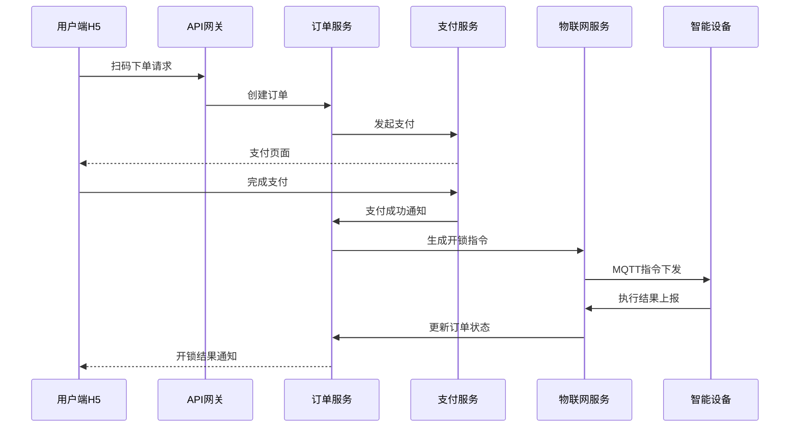

# 杜美人管理系统需求规格说明书 (SRS)

## 一、项目概述

### 1.1 项目背景

本项目旨在开发一个专业的智能开锁设备管理平台，通过物联网技术实现设备远程控制，建立完整的商业运营生态系统。平台将聚焦"智能化、便民化、商业化"的理念，为用户提供便捷的远程开锁服务，为商户提供高效的设备管理和运营工具。

### 1.2 项目目标

- 搭建多终端访问平台（Web管理系统、H5用户端）
- 建立完整的支付体系和营销工具，实现商业变现
- 支持多商户、多场地的分级管理模式
- 提供实时设备监控和远程控制能力
- 建立完善的财务管理和数据分析体系
- 构建可扩展的物联网设备接入架构

### 1.3 目标用户群体

- **终端用户**：需要使用智能开锁服务的消费者
- **场地管理员**：负责具体场地设备运营的管理人员
- **商户**：拥有多个场地的经营者
- **运营合伙人**：参与平台推广和运营的合作伙伴
- **平台管理员**：负责整个平台运营管理的工作人员
- **设备维护人员**：负责设备安装、维护的技术人员

### 1.4 商业价值

- 通过设备使用费和服务费实现主要收入
- 建立多层级分成体系，激励合作伙伴参与
- 通过营销工具提升用户粘性和消费频次
- 利用数据分析优化运营策略和设备配置
- 构建可复制的商业模式，支持快速扩张
- 为传统行业提供智能化升级解决方案

### 1.5 技术架构优势

- **统一响应式管理后台**：一套代码适配PC、平板、手机多端，降低开发和维护成本
- **多角色权限控制**：灵活的权限体系，支持不同角色用户使用同一系统
- **微服务架构**：模块化设计，支持独立部署和扩展
- **现代化技术栈**：Vue 3 + TypeScript + Element Plus，保证系统的先进性和可维护性

## 二、系统架构

### 2.1 技术框架选型

**前端技术栈**
- **统一管理后台**： Vue Vben Admin (Vue 3 + Element Plus + TypeScript)
  - 基于成熟的开源管理后台框架，快速开发
  - 内置多角色权限控制系统（RBAC）
  - 响应式设计，支持PC/平板/手机自适应
  - 丰富的组件库和页面模板
  - 完善的路由权限和菜单管理
- **商户管理端**：Uni-app + Vue 3 (微信小程序)
- **用户端**：Vue 3 + Vant UI (H5响应式设计)

**后端技术栈**
- **后端框架**：Node.js(Nest.js) 或 Java(Spring Boot)
- **数据库**：MySQL 8.0(主数据) + Redis 6.0(缓存/会话)
- **消息队列**：MQTT Broker(EMQ X) + Redis Pub/Sub
- **存储**：阿里云OSS(图片/文件云存储)
- **支付**：集成微信支付+支付宝(支持退款、分账)
- **物联网**：阿里云IoT平台 或 腾讯云IoT平台

**基础设施**
- **部署**：Docker + Kubernetes + Nginx
- **监控**：Prometheus + Grafana + ELK Stack
- **CDN**：阿里云CDN 或 腾讯云CDN

### 2.2 项目结构（微服务架构）

```text
├── admin-frontend          # 统一管理后台（基于 Vue Vben Admin）
│
├── merchant-frontend       # 商户管理端-微信小程序 (Uni-app+Vue3)
│
├── user-frontend           # 用户端-H5应用 (Vue3+Vant UI)
│
├── backend
│   ├── gateway-service     # API网关服务(统一入口/鉴权/限流)
│   ├── user-service        # 用户管理服务
│   ├── device-service      # 设备管理服务
│   ├── order-service       # 订单/支付服务
│   ├── merchant-service    # 商户管理服务
│   ├── venue-service       # 场地管理服务
│   ├── marketing-service   # 营销工具服务
│   ├── finance-service     # 财务管理服务
│   ├── iot-service         # 物联网控制服务
│   ├── notification-service# 消息通知服务
│   └── analytics-service   # 数据分析服务
│
├── iot-platform
│   ├── device-gateway      # 设备接入网关
│   ├── protocol-adapter    # 协议适配器
│   └── command-processor   # 指令处理器
│
├── database
│   ├── schemas           # 数据库结构定义
│   └── migrations        # 数据库迁移脚本
│
├── docs                # 项目文档
│   ├── api             # API文档(Swagger/OpenAPI)
│   ├── architecture    # 架构设计文档
│   └── deployment      # 部署文档
│
├── deploy              # 部署配置
│   ├── docker          # Docker配置文件
│   ├── k8s             # Kubernetes配置
│   └── scripts         # 部署脚本
│
└── tools              # 开发工具/脚本
```

### 2.3 核心业务流程架构



## 三、功能需求详述

### 3.1 用户端功能（H5）

#### 3.1.1 用户账户系统

- **注册登录**
  - 手机号注册/登录（短信验证码）
  - 微信一键登录/绑定
  - 游客模式支持（限制功能）
  - 账户安全设置（修改密码、绑定手机）
  - 实名认证（可选，用于高价值服务）

- **个人中心**
  - 基本信息管理（头像、昵称、性别）
  - 钱包余额查询和充值
  - 消费记录和账单详情
  - 优惠券和包月卡管理
  - 收货地址管理（如需邮寄服务）
  - 消息通知中心
  - 隐私设置和数据授权

#### 3.1.2 设备使用功能

- **扫码开锁**
  - 二维码扫描识别设备
  - 设备状态实时查询
  - 货道选择和商品确认
  - 价格展示和支付确认
  - 开锁进度实时显示
  - 开锁成功/失败处理

- **支付系统**
  - 微信支付/支付宝支付
  - 钱包余额支付
  - 组合支付（余额+第三方支付）
  - 优惠券自动抵扣
  - 包月卡权益使用
  - 支付安全验证

- **订单管理**
  - 历史订单查询（支持筛选）
  - 订单详情查看
  - 订单状态跟踪
  - 退款申请和处理
  - 发票申请（电子发票）
  - 订单评价和反馈

#### 3.1.3 营销功能体验

- **优惠活动参与**
  - 关注有礼活动参与
  - 优惠满减活动使用
  - 优惠券领取和使用
  - 包月卡购买和续费
  - 限时特惠活动参与

- **会员权益**
  - 会员等级展示
  - 专属优惠和折扣
  - 积分累积和兑换
  - 生日特权和节日福利
  - VIP客服通道

#### 3.1.4 辅助功能

- **帮助中心**
  - 使用教程和FAQ
  - 常见问题解答
  - 联系客服（在线客服/电话）
  - 意见反馈提交
  - 服务条款和隐私政策

- **便民工具**
  - 附近设备地图查找
  - 设备使用状态查询
  - 故障报修提交
  - 充值记录查询
  - 消费统计分析

### 3.2 统一管理后台功能（响应式Web应用）

#### 3.2.1  Vue Vben Admin框架优势

**框架特性**
- **开箱即用**：基于Vue 3 + TypeScript + Element Plus的成熟框架
- **响应式设计**：内置多设备适配，PC/平板/手机自动适应
- **权限系统**：完善的RBAC权限控制，支持路由权限和按钮权限
- **丰富组件**：内置大量业务组件和页面模板
- **主题定制**：支持多主题切换和自定义主题
- **国际化**：内置i18n国际化支持

**内置功能模块**
- 用户管理和角色权限
- 菜单管理和路由配置
- 数据字典和系统配置
- 操作日志和系统监控
- 文件上传和图片管理
- 数据表格和表单组件

**技术优势**
- TypeScript类型安全
- Vite构建工具，开发体验优秀
- ESLint + Prettier代码规范
- 完善的Mock数据方案

#### 3.2.2 权限角色设计

**角色类型**
- **超级管理员**：拥有所有功能权限
- **平台管理员**：负责平台运营管理
- **财务管理员**：负责财务相关功能
- **运营管理员**：负责用户和营销管理
- **合伙人**：拥有合伙人相关功能权限
- **客服人员**：负责客户服务功能

**权限控制机制**
- 基于RBAC（角色访问控制）模型
- 菜单权限：根据角色显示不同菜单
- 功能权限：控制具体功能的访问和操作
- 数据权限：控制可查看的数据范围
- 字段权限：控制敏感字段的显示

#### 3.2.2 仪表盘（多角色视图）

**平台管理员视图**
- 全站数据概览（营收、用户、设备、订单）
- 实时监控大屏
- 异常告警处理
- 关键指标趋势分析
- 各商户/合伙人业绩排行

**合伙人视图**
- 个人业绩统计（今日/本月/累计）
- 团队业绩统计和排行
- 推广用户数量和转化率
- 佣金收入统计和趋势
- 待结算和已结算金额
- 业绩目标达成情况

**财务管理员视图**
- 财务数据汇总
- 资金流水统计
- 分成结算状态
- 提现审核待办
- 财务风险预警

#### 3.2.3 用户管理（平台管理员权限）

**用户列表管理**
- 用户基本信息展示和管理
- 账户信息管理和调整
- 用户状态管理和黑名单
- 用户行为分析和标签
- 批量操作和数据导出

**用户反馈管理**
- 反馈信息收集和分类
- 处理流程管理和分配
- 满意度统计和分析

#### 3.2.4 设备管理（平台管理员权限）

**设备列表管理**
- 设备信息管理和监控
- 设备状态实时查看
- 远程控制和参数配置
- 故障处理和维护记录

**场地管理**
- 场地信息维护
- 设备分布管理
- 运营配置设置
- 收入分成管理

**商户管理**
- 商户信息和资质管理
- 财务配置和分成设置
- 业务数据统计分析

#### 3.2.5 合伙人管理功能（合伙人权限）

**推广管理**
- 专属推广工具（二维码、链接、素材）
- 推广用户管理和跟进
- 推广效果分析
- 客户服务和维护

**团队管理**
- 下级合伙人管理
- 团队结构和业绩展示
- 合伙人招募和培训
- 团队考核和评估

**业绩统计**
- 个人和团队业绩分析
- 推广数据统计
- 佣金明细查询
- 财务报表生成

#### 3.2.6 营销工具（运营管理员权限）

**活动管理**
- 关注有礼、优惠满减活动配置
- 优惠券管理和发放
- 包月卡管理和销售
- 活动效果统计分析

#### 3.2.7 财务管理（财务管理员权限）

**营收统计**
- 多维度营收分析
- 财务报表生成
- 成本效益分析

**资金管理**
- 资金流水管理
- 分成计算和结算
- 提现审核和处理
- 财务对账功能

#### 3.2.8 运营合伙人管理（平台管理员权限）

**合伙人管理**
- 合伙人信息和资质管理
- 分成配置和规则设置
- 业绩统计和排行
- 合伙人等级管理

#### 3.2.9 系统管理（超级管理员权限）

**权限管理**
- 角色权限配置
- 用户角色分配
- 权限审计日志

**系统配置**
- 基础参数设置
- 第三方服务配置
- 安全策略配置

### 3.3 商户管理端功能（微信小程序）

#### 3.3.1 商户仪表盘

- **经营数据概览**
  - 今日营收和订单量
  - 设备使用率统计
  - 场地排行和对比
  - 异常设备告警
  - 库存不足提醒

- **快捷操作**
  - 设备状态快速查看
  - 故障设备快速处理
  - 库存快速补充
  - 价格快速调整

#### 3.3.2 设备管理

- **设备监控**
  - 设备列表和状态
  - 设备在线率监控
  - 设备使用情况
  - 故障设备处理
  - 设备维护记录

- **设备操作**
  - 远程开锁测试
  - 设备参数调整
  - 设备重启操作
  - 货道状态管理
  - 设备报修提交

#### 3.3.3 场地管理

- **场地信息**
  - 场地基本信息查看
  - 场地设备分布
  - 场地营收统计
  - 场地客流分析

- **场地运营**
  - 营业时间设置
  - 特殊公告发布
  - 客服信息更新
  - 场地图片管理

#### 3.3.4 订单管理

- **订单查询**
  - 实时订单监控
  - 历史订单查询
  - 异常订单处理
  - 退款订单审核

- **订单分析**
  - 销售趋势分析
  - 热销商品统计
  - 时段销售分析
  - 客户消费分析

#### 3.3.5 库存管理

- **库存监控**
  - 实时库存查询
  - 库存不足告警
  - 补货提醒设置
  - 库存变动记录

- **补货管理**
  - 补货计划制定
  - 补货记录管理
  - 供应商联系
  - 成本核算

#### 3.3.6 财务管理

- **收入统计**
  - 营收数据查询
  - 分成明细查看
  - 提现申请提交
  - 财务报表查看

- **成本管理**
  - 运营成本统计
  - 设备服务费
  - 维护费用记录
  - 利润分析

#### 3.3.7 消息中心

- **通知管理**
  - 系统通知接收
  - 设备告警通知
  - 业务消息处理
  - 客服消息回复

### 3.4 管理后台功能（Web）

#### 3.2.1 仪表盘

- **实时数据看板**
  - 今日/本月营收统计
  - 设备在线率和使用率
  - 用户活跃度和新增用户
  - 订单量和成功率统计
  - 异常告警和待处理事项
  - 关键指标趋势图表

- **数据可视化**
  - 营收趋势分析图
  - 设备使用热力图
  - 用户地域分布图
  - 时段使用分析图
  - 商户/场地排行榜
  - 实时监控大屏

#### 3.2.2 用户管理

**用户列表管理**
- **基本信息展示**
  - 用户ID、用户编号、会员昵称
  - 手机号码、注册时间、最后登录
  - 来源应用端、所属场地
  - 用户标签和分组
  
- **账户信息管理**
  - 钱包余额、余额过期时间
  - 充值记录和消费记录
  - 优惠券持有情况
  - 包月卡使用状态
  - 积分余额和等级

- **状态管理功能**
  - 用户状态（正常/冻结/注销）
  - 黑名单设置和原因记录
  - 风险用户标记
  - 实名认证状态
  - 会员等级调整

- **操作功能**
  - 用户详情查看
  - 消费记录查询
  - 钱包余额调整
  - 优惠券发放
  - 消息推送
  - 账户冻结/解冻
  - 用户行为分析

**用户反馈管理**
- **反馈信息收集**
  - 会员基本信息
  - 关联订单编号
  - 反馈渠道（APP/电话/邮件）
  - 反馈类型分类
  - 反馈时间和内容
  - 附件和截图

- **处理流程管理**
  - 反馈分配和转派
  - 处理优先级设置
  - 处理进度跟踪
  - 处理结果记录
  - 处理人员和时间
  - 用户满意度回访

- **统计分析功能**
  - 反馈类型统计
  - 处理时效分析
  - 满意度统计
  - 问题趋势分析
  - 处理人员绩效

#### 3.2.3 设备管理

**设备列表管理**
- **设备基本信息**
  - 设备编号、设备名称、设备型号
  - 所属商户、所属场地
  - 设备分类和规格参数
  - 安装时间、分配时间
  - 设备备注和标签

- **连接状态监控**
  - 联网方式（4G/WiFi/以太网）
  - 设备在线状态（在线/离线/故障）
  - 信号强度和网络质量
  - 最后通信时间
  - 固件版本和更新状态
  - 电池电量（如适用）

- **运营数据统计**
  - 累计订单数量
  - 今日/本月使用次数
  - 成功率和故障率
  - 平均响应时间
  - 收入统计
  - 使用时段分析

- **硬件信息管理**
  - 物联网卡号、IMEI
  - MAC地址、设备序列号
  - 硬件配置信息
  - 传感器状态
  - 维护记录

- **设备操作功能**
  - 查看设备二维码
  - 远程重启和诊断
  - 固件升级推送
  - 参数配置下发
  - 设备解绑和重新分配
  - 故障报修和维护记录
  - 设备弹窗内容设置
  - 使用统计报表导出

**投放场地管理**
- **场地基本信息**
  - 场地名称、场地编码
  - 详细地址和GPS坐标
  - 场地类型（商场/学校/办公楼等）
  - 场地面积和人流量
  - 营业时间和特殊说明

- **设备配置管理**
  - 场地设备数量统计
  - 设备分布和布局图
  - 设备类型配置
  - 场地设备容量规划

- **管理信息维护**
  - 场地负责人信息
  - 绑定手机号和联系方式
  - 客服电话和服务时间
  - 紧急联系人信息
  - 场地合作协议

- **运营配置设置**
  - 友情提示和使用说明
  - 充值优惠配置
  - 单价和计费规则
  - 区间收费设置
  - 会员折扣配置
  - 营销活动参与设置

- **场地操作功能**
  - 场地信息修改
  - 设备添加和移除
  - 位置信息更新
  - 运营数据查看
  - 收入分成设置
  - 场地状态管理（启用/停用）

**经营商户管理**
- **商户基本信息**
  - 商户名称、商户编码
  - 营业执照和资质信息
  - 法人代表和联系方式
  - 经营范围和业务类型
  - 注册地址和办公地址

- **账户管理**
  - 登录账户和权限设置
  - 密码安全策略
  - 登录日志和安全记录
  - 多用户权限分配
  - API访问权限

- **财务配置**
  - 手续费率设置
  - 提现比例和规则
  - 预留金额要求
  - 结算周期配置
  - 分成比例设置
  - 保证金管理

- **业务管理**
  - 所属场地列表
  - 设备数量统计
  - 业务员分配
  - 客户信息管理
  - 合作协议管理
  - 商户等级和信用评级

- **状态和操作**
  - 商户状态（正常/暂停/注销）
  - 审核状态和流程
  - 备注和标签管理
  - 添加时间和更新记录
  - 商户数据导出

**设备服务费管理**
- **服务费信息**
  - 设备编号和设备信息
  - 服务费类型（月费/年费/按次）
  - 服务费金额和计费规则
  - 服务开始和到期时间
  - 续费提醒设置

- **服务状态管理**
  - 服务状态（正常/欠费/暂停）
  - 缴费记录和发票
  - 欠费提醒和催收
  - 服务暂停和恢复
  - 服务终止处理

- **归属关系**
  - 所属商户信息
  - 所属场地信息
  - 责任人联系方式
  - 服务协议和条款
  - 变更记录

#### 3.2.4 货品管理

**货品信息管理**
- **基本信息**
  - 货品名称、货品编码、条形码
  - 货品分类和标签
  - 货品规格和型号
  - 供应商信息
  - 成本价和建议售价
  - 货品图片和详情页配置

- **库存管理**
  - 总库存数量统计
  - 各场地库存分布
  - 库存变动记录
  - 入库和出库管理
  - 库存盘点功能
  - 库存报警阈值设置
  - 自动补货提醒

- **销售管理**
  - 上架/下架状态控制
  - 价格策略设置
  - 促销活动配置
  - 销量统计分析
  - 热销商品排行
  - 滞销商品预警

- **质量管理**
  - 保质期管理
  - 批次追踪
  - 质量问题记录
  - 退换货处理
  - 供应商评价

**货品操作功能**
- 批量导入/导出
- 货品信息修改
- 库存调整
- 价格批量更新
- 货品下架/删除
- 销售数据分析
- 库存报表生成

#### 3.2.5 营销工具

**关注有礼活动**
- **活动配置**
  - 活动名称和描述
  - 应用场地范围选择
  - 活动封面图和宣传素材
  - 赠送金额和奖励类型
  - 参与条件设置（关注/分享/注册）
  - 每人限制次数

- **时间管理**
  - 活动开始和结束日期
  - 每日参与时间段限制
  - 活动预热和延期设置
  - 自动开启/关闭功能

- **效果统计**
  - 参与人数统计
  - 转化率分析
  - 成本效益分析
  - 用户留存跟踪
  - 活动ROI计算

**优惠满减活动**
- **活动设置**
  - 满减规则配置（满X减Y）
  - 适用商品范围
  - 应用场地和设备
  - 活动封面和说明
  - 叠加规则设置

- **使用限制**
  - 每用户使用次数限制
  - 单笔订单使用限制
  - 最低消费金额要求
  - 特殊商品排除规则

- **数据分析**
  - 活动参与度统计
  - 优惠金额统计
  - 带动销售额分析
  - 用户行为变化
  - 活动效果评估

**优惠券管理**
- **券基本信息**
  - 优惠券名称和编码
  - 券类型（满减/折扣/免费）
  - 面值和折扣比例
  - 封面图和使用说明
  - 发放渠道设置

- **使用规则配置**
  - 适用场地和设备范围
  - 适用商品类别
  - 使用条件和限制
  - 有效期设置
  - 叠加使用规则

- **发放和统计**
  - 发行数量设置
  - 批量发放功能
  - 定向用户发放
  - 使用数量统计
  - 过期券回收
  - 券使用分析报告

**包月卡管理**
- **卡片基本信息**
  - 卡名称和卡类型
  - 适用场地范围
  - 卡片等级和权益
  - 卡片图标和说明
  - 购买页面配置

- **价格和权益配置**
  - 卡片价格设置
  - 包含使用次数
  - 每日最高使用次数
  - 使用期限设置
  - 额外折扣权益
  - 专属服务权益

- **销售和使用管理**
  - 销售数量统计
  - 用户购买记录
  - 使用情况跟踪
  - 续费提醒设置
  - 退款处理规则
  - 卡片使用分析

**营销活动统一管理**
- 活动日历和排期
- 活动效果对比分析
- 营销成本统计
- 用户参与度分析
- A/B测试功能
- 活动模板管理

#### 3.2.6 财务管理

**营收统计分析**
- **全站营收统计**
  - 实时营收数据展示
  - 日/周/月/年营收趋势
  - 营收构成分析（设备费/服务费/营销收入）
  - 同比/环比增长分析
  - 营收目标达成情况
  - 营收预测和规划

- **多维度营收分析**
  - 商户营收排行和分析
  - 场地营收对比和趋势
  - 设备营收效率排行
  - 时段营收分布分析
  - 商品类别营收统计
  - 用户消费贡献分析

- **财务报表生成**
  - 损益表自动生成
  - 现金流量表
  - 资产负债表
  - 财务分析报告
  - 税务报表支持
  - 自定义报表配置

**资金流水管理**
- **流水记录管理**
  - 详细资金流水记录
  - 收入/支出分类统计
  - 流水查询和筛选
  - 异常流水监控
  - 流水对账功能
  - 银行流水导入对比

- **订单财务管理**
  - 订单收入统计
  - 退款订单处理
  - 订单财务状态跟踪
  - 订单成本分析
  - 订单利润计算
  - 订单财务报表

- **分成明细统计**
  - 平台分成计算
  - 商户分成明细
  - 合伙人分成统计
  - 场地分成记录
  - 分成规则配置
  - 分成结算周期管理

- **提现记录管理**
  - 提现申请审核
  - 提现记录查询
  - 提现手续费计算
  - 提现状态跟踪
  - 银行账户管理
  - 提现限额设置

**财务风控管理**
- **风险监控**
  - 异常交易监控
  - 大额交易预警
  - 频繁退款预警
  - 账户异常行为检测
  - 财务数据异常告警

- **对账管理**
  - 第三方支付对账
  - 银行流水对账
  - 内部账务对账
  - 对账差异处理
  - 对账报告生成

- **财务审计**
  - 财务操作日志
  - 权限操作记录
  - 数据变更追踪
  - 审计报告生成
  - 合规检查功能

#### 3.2.7 运营合伙人管理

**合伙人基本管理**
- **合伙人信息**
  - 合伙人姓名、身份证号
  - 联系方式和地址信息
  - 银行账户和支付信息
  - 合作协议和合同管理
  - 合伙人等级和信用评级

- **账户权限管理**
  - 登录账户和密码设置
  - 权限范围配置
  - 数据访问权限
  - 操作权限控制
  - 登录安全设置

- **业务管理**
  - 负责区域和场地分配
  - 推广渠道管理
  - 客户资源分配
  - 业绩目标设置
  - 团队管理功能

**分成配置管理**
- **分成规则设置**
  - 分成比例配置
  - 阶梯分成规则
  - 业绩奖励机制
  - 特殊奖励设置
  - 分成计算公式

- **结算管理**
  - 分成结算周期
  - 结算方式配置
  - 提现规则设置
  - 税务处理
  - 结算记录查询

- **业绩统计**
  - 推广用户统计
  - 营收贡献分析
  - 团队业绩统计
  - 排行榜和激励
  - 业绩趋势分析

#### 3.2.8 员工管理

**员工角色权限**
- **角色定义**
  - 系统管理员
  - 运营管理员
  - 财务管理员
  - 客服人员
  - 数据分析师
  - 设备维护员

- **权限配置**
  - 菜单访问权限
  - 数据查看权限
  - 操作执行权限
  - 数据导出权限
  - 敏感信息访问权限

- **权限管理**
  - 角色权限分配
  - 用户角色绑定
  - 权限继承规则
  - 临时权限授权
  - 权限审计日志

**员工列表管理**
- **员工信息**
  - 员工基本信息
  - 部门和职位
  - 入职时间和状态
  - 联系方式
  - 工作职责描述

- **账户管理**
  - 登录账户设置
  - 密码安全策略
  - 多因素认证
  - 登录日志记录
  - 账户状态管理

- **绩效管理**
  - 工作量统计
  - 绩效考核记录
  - 客户满意度
  - 工作质量评估
  - 培训记录管理

#### 3.2.9 物联网卡管理

**绑卡记录管理**
- **卡片信息**
  - 物联网卡号、ICCID
  - 运营商信息
  - 套餐类型和流量
  - 激活时间和状态
  - 设备绑定关系

- **绑定管理**
  - 设备绑卡操作
  - 绑定关系查询
  - 解绑和重新绑定
  - 绑定历史记录
  - 批量绑定功能

- **状态监控**
  - 卡片在线状态
  - 流量使用情况
  - 信号强度监控
  - 异常状态告警
  - 卡片生命周期管理

**充卡记录统计**
- **充值管理**
  - 充值记录查询
  - 充值金额统计
  - 充值方式分析
  - 批量充值功能
  - 自动充值设置

- **费用统计**
  - 月度费用统计
  - 流量费用分析
  - 成本控制分析
  - 费用预算管理
  - 费用报表生成

- **优化建议**
  - 套餐使用分析
  - 成本优化建议
  - 流量使用预测
  - 套餐调整建议
  - 供应商对比分析

#### 3.2.10 消息推送管理

**消息设置配置**
- **消息模板管理**
  - 消息代码和分类
  - 消息内容模板
  - 变量参数设置
  - 消息格式配置

- **触发条件设置**
  - 关联动作配置
  - 触发时机设置
  - 条件规则配置
  - 频率限制设置
  - 用户群体筛选

- **推送渠道配置**
  - 短信推送设置
  - 邮件推送配置
  - APP推送设置
  - 微信推送配置
  - 站内消息设置

**推送管理功能**
- **推送设置**
  - 推送时间策略
  - 推送频率控制
  - 用户偏好设置
  - 免打扰时间设置
  - 推送优先级配置

- **通知人员管理**
  - 管理员通知设置
  - 紧急联系人配置
  - 通知群组管理
  - 通知权限设置
  - 通知升级机制

- **推送记录查询**
  - 推送历史记录
  - 推送成功率统计
  - 用户响应分析
  - 推送效果评估
  - 失败原因分析

#### 3.2.11 系统设置

**站点基础设置**
- **基本信息配置**
  - 站点名称和Logo
  - 公司信息和联系方式
  - 服务条款和隐私政策
  - 版权信息设置
  - 备案信息配置

- **SEO设置**
  - 网站标题和描述
  - 关键词配置
  - 页面SEO优化
  - 搜索引擎收录
  - 网站地图生成

**前端配置管理**
- **界面配置**
  - 主题颜色设置
  - 页面布局配置
  - 导航菜单设置
  - 广告位管理
  - 轮播图配置

- **功能开关**
  - 功能模块开关
  - 支付方式开关
  - 营销功能开关
  - 第三方集成开关
  - 调试模式开关

**安全设置配置**
- **访问控制**
  - IP白名单设置
  - 访问频率限制
  - 防暴力破解设置
  - 验证码配置
  - 安全策略设置

- **数据安全**
  - 数据加密设置
  - 备份策略配置
  - 日志保留策略
  - 敏感信息脱敏
  - 安全审计配置

**提现设置管理**
- **提现规则**
  - 最低提现金额
  - 提现手续费设置
  - 提现时间限制
  - 提现次数限制
  - 提现审核流程

- **账户管理**
  - 银行账户配置
  - 第三方支付配置
  - 账户验证设置
  - 风控规则配置
  - 异常处理流程

**运维设置配置**
- **系统监控**
  - 性能监控配置
  - 告警规则设置
  - 日志级别配置
  - 监控指标设置
  - 报告生成配置

- **维护管理**
  - 系统维护公告
  - 定时任务配置
  - 缓存管理设置
  - 数据清理规则
  - 系统升级管理

### 3.3 设备控制功能

#### 3.3.1 开锁控制流程

**标准开锁流程**
1. **订单创建阶段**
   - 用户扫码识别设备和货道
   - 系统验证设备状态和商品库存
   - 创建订单并计算费用
   - 用户确认订单信息

2. **支付处理阶段**
   - 调用支付接口处理付款
   - 验证支付结果和回调
   - 更新订单支付状态
   - 触发开锁指令生成

3. **指令生成阶段**
   - 生成唯一开锁指令ID
   - 组装指令数据（设备ID+货道+时间戳+动态码）
   - 对指令进行加密和签名
   - 设置指令有效期和重试机制

4. **指令下发阶段**
   - 通过MQTT Broker发送指令
   - 物联网平台路由到目标设备
   - 设备接收并解析指令
   - 验证指令完整性和有效性

5. **设备执行阶段**
   - 设备验证指令合法性
   - 检查货道状态和库存
   - 驱动电机执行开锁动作
   - 检测开锁结果和商品出货

6. **结果反馈阶段**
   - 设备上报执行结果
   - 系统更新订单状态
   - 记录操作日志
   - 通知用户开锁结果

**异常处理流程**
- 支付失败处理和订单取消
- 设备离线时的指令缓存
- 开锁失败时的退款处理
- 网络异常时的重试机制
- 设备故障时的人工介入

#### 3.3.2 设备监控系统

**实时状态监控**
- **设备在线监控**
  - 心跳包监控机制
  - 在线/离线状态实时更新
  - 离线时长统计
  - 网络连接质量监控
  - 设备重连自动处理

- **设备健康监控**
  - 硬件状态监控（电机、传感器、电源）
  - 软件状态监控（固件版本、系统负载）
  - 温度、湿度等环境参数监控
  - 电池电量和充电状态监控
  - 存储空间和内存使用监控

- **业务状态监控**
  - 货道状态和库存监控
  - 开锁成功率统计
  - 响应时间监控
  - 故障频率统计
  - 维护需求预警

**告警机制**
- **告警规则配置**
  - 设备离线告警
  - 开锁失败率告警
  - 硬件故障告警
  - 库存不足告警
  - 异常操作告警

- **告警处理流程**
  - 多级告警机制
  - 告警升级策略
  - 自动处理规则
  - 人工介入机制
  - 告警记录和统计

- **通知方式**
  - 短信通知
  - 邮件通知
  - APP推送通知
  - 微信群通知
  - 电话语音通知

#### 3.3.3 远程控制功能

**远程操作指令**
- 设备重启指令
- 参数配置更新
- 固件升级推送
- 货道测试指令
- 状态查询指令
- 日志收集指令

**批量操作功能**
- 批量设备重启
- 批量参数配置
- 批量固件升级
- 批量状态查询
- 批量告警设置

**安全控制机制**
- 指令权限验证
- 操作日志记录
- 敏感操作二次确认
- 指令加密传输
- 防重放攻击机制

#### 3.3.4 数据采集与分析

**设备数据采集**
- 使用频次数据
- 故障日志数据
- 环境参数数据
- 用户行为数据
- 维护记录数据

**数据分析功能**
- 设备使用趋势分析
- 故障模式识别
- 维护需求预测
- 用户使用习惯分析
- 设备效率优化建议

**报表生成**
- 设备运行报告
- 故障统计报告
- 维护计划报告
- 使用效率报告
- 成本效益分析报告

## 四、非功能性需求

### 4.1 性能需求

**响应时间要求**
- H5页面首屏加载时间 < 2秒（95%情况下）
- 管理后台页面加载时间 < 3秒（95%情况下）
- API接口响应时间 < 500ms（95%情况下）
- 开锁指令端到端响应时间 < 5秒
- 数据库查询响应时间 < 200ms
- 文件上传响应时间 < 10秒（10MB以内）

**并发处理能力**
- 支持2000+并发用户同时在线
- 支持500+并发开锁操作
- 支持100+管理员同时操作
- 峰值QPS达到5000+
- 数据库连接池支持200+并发连接

**数据处理能力**
- 支持每日50万+订单处理
- 支持10万+设备同时在线
- 支持1TB+数据存储
- 支持100万+用户数据管理
- 实时数据处理延迟 < 1秒

**资源使用优化**
- 服务器CPU使用率 < 70%
- 内存使用率 < 80%
- 数据库连接使用率 < 80%
- 网络带宽使用率 < 60%
- 存储空间使用率 < 85%

### 4.2 安全需求

**数据安全**
- 用户敏感数据AES-256加密存储
- 密码采用bcrypt加盐哈希
- 数据传输全程HTTPS加密
- 数据库连接SSL加密
- 敏感日志信息脱敏处理
- 定期数据安全审计

**接口安全**
- JWT Token身份认证
- API接口签名验证
- 请求频率限制（Rate Limiting）
- IP白名单访问控制
- 防SQL注入、XSS、CSRF攻击
- 输入参数严格验证和过滤

**设备通信安全**
- MQTT通信TLS加密
- 设备指令数字签名
- 设备身份认证机制
- 指令防重放攻击
- 设备密钥定期轮换
- 异常设备自动隔离

**支付安全**
- 符合PCI DSS安全标准
- 支付数据不落地原则
- 支付接口HTTPS加密
- 支付回调签名验证
- 异常交易实时监控
- 资金安全风控机制

**权限安全**
- RBAC权限控制模型
- 最小权限原则
- 敏感操作二次验证
- 操作日志完整记录
- 异常登录行为检测
- 账户安全策略配置

### 4.3 可用性需求

**系统可用性**
- 系统年可用率 ≥ 99.9%（允许年停机时间 < 8.76小时）
- 核心业务功能可用率 ≥ 99.95%
- 支付功能可用率 ≥ 99.99%
- 设备控制功能可用率 ≥ 99.9%
- 数据查询功能可用率 ≥ 99.8%

**故障恢复**
- 系统故障检测时间 < 1分钟
- 自动故障恢复时间 < 5分钟
- 人工故障处理时间 < 30分钟
- 数据恢复时间 < 2小时
- 业务完全恢复时间 < 4小时

**数据备份策略**
- 数据库每日全量备份
- 关键数据实时增量备份
- 备份数据异地存储
- 备份数据加密保护
- 定期备份恢复测试
- 备份保留期限1年

**容灾机制**
- 双机热备部署
- 数据库主从复制
- 负载均衡故障转移
- 异地容灾备份
- 灾难恢复预案
- 定期容灾演练

### 4.4 兼容性需求

**响应式Web应用兼容性**
- **浏览器支持**
  - Chrome浏览器：最新版本和前两个版本
  - Firefox浏览器：最新版本和前两个版本
  - Safari浏览器：最新版本和前一版本
  - Edge浏览器：最新版本
  - 微信浏览器：最新版本和前一版本

- **设备和屏幕适配**
  - PC端：1024px - 4K分辨率支持
  - 平板端：768px - 1024px响应式适配
  - 手机端：320px - 768px移动优化
  - 高DPI屏幕支持（Retina等）

- **操作系统兼容**
  - Windows 10+、macOS 10.14+、Linux主流发行版
  - iOS 12+、Android 7.0+（API Level 24+）

- **网络环境适配**
  - 2G/3G/4G/5G/WiFi网络环境
  - 弱网络环境优化
  - 离线缓存支持

**移动端专项兼容性**
- 触控操作优化
- 手势支持（滑动、缩放等）
- 移动端键盘适配
- 横竖屏切换支持
- 移动端性能优化

**设备兼容性**
- 支持多厂商智能开锁设备
- 支持多种通信协议（4G、WiFi、以太网）
- 支持不同型号的物联网卡
- 向下兼容旧版本设备固件
- 支持设备固件在线升级

**第三方集成兼容性**
- 微信支付API最新版本
- 支付宝支付API最新版本
- 短信服务商API兼容
- 云存储服务API兼容
- 物联网平台API兼容

### 4.5 可扩展性需求

**架构扩展性**
- 微服务架构支持水平扩展
- 数据库分库分表支持
- 缓存集群扩展支持
- 消息队列集群扩展
- 负载均衡动态扩容
- 容器化部署支持

**业务扩展性**
- 新设备类型快速接入
- 新支付方式快速集成
- 新营销工具快速开发
- 多租户架构支持
- 多时区支持

**数据扩展性**
- 数据模型版本化管理
- 数据库schema在线变更
- 历史数据归档机制
- 大数据分析平台对接
- 数据导入导出标准化
- 第三方数据源集成

**功能扩展性**
- 插件化功能模块
- API版本控制机制
- 配置化业务规则
- 工作流引擎支持
- 规则引擎支持
- 低代码平台集成

### 4.6 易用性需求

**用户体验**
- 界面设计简洁直观
- 操作流程简化优化
- 错误提示友好明确
- 帮助文档完善
- 无障碍访问支持

**管理便捷性**
- 一键部署和升级
- 可视化配置管理
- 自动化运维工具
- 智能监控告警
- 故障自动诊断
- 性能优化建议

**开发友好性**
- 完善的API文档
- SDK和示例代码
- 开发环境快速搭建
- 调试工具支持
- 代码规范和注释
- 技术支持服务

## 五、数据需求

### 5.1 核心数据实体

**用户相关数据**
- **用户基本信息**：用户ID、手机号、昵称、头像、注册时间、最后登录时间
- **用户账户信息**：钱包余额、积分、会员等级、实名认证状态
- **用户行为数据**：登录记录、操作日志、消费记录、偏好设置
- **用户关系数据**：推荐关系、分销关系、社交关系

**设备相关数据**
- **设备基本信息**：设备ID、设备编号、设备型号、硬件版本、固件版本
- **设备状态数据**：在线状态、健康状态、位置信息、环境参数
- **设备配置数据**：参数配置、货道配置、价格配置、权限配置
- **设备运营数据**：使用统计、故障记录、维护记录、收入统计

**订单交易数据**
- **订单基本信息**：订单ID、用户ID、设备ID、商品信息、订单金额
- **订单状态数据**：订单状态、支付状态、开锁状态、完成时间
- **支付相关数据**：支付方式、支付流水号、退款记录、优惠使用记录
- **物流相关数据**：货道信息、出货状态、异常处理记录

**商户场地数据**
- **商户信息**：商户ID、商户名称、联系信息、资质信息、合作协议
- **场地信息**：场地ID、场地名称、地址信息、场地类型、运营时间
- **分成配置**：分成比例、结算规则、提现配置、财务账户
- **运营数据**：营收统计、设备统计、用户统计、效率分析

**营销活动数据**
- **活动基本信息**：活动ID、活动名称、活动类型、活动规则、时间范围
- **参与数据**：参与用户、使用次数、转化效果、成本统计
- **优惠券数据**：券码信息、使用状态、有效期、适用范围
- **会员卡数据**：卡片信息、购买记录、使用记录、续费记录

**系统配置数据**
- **基础配置**：系统参数、业务规则、价格策略、权限配置
- **第三方配置**：支付配置、短信配置、云存储配置、物联网配置
- **运营配置**：营销规则、分成规则、风控规则、告警规则

### 5.2 数据存储需求

**数据保存策略**
- **永久保存数据**
  - 用户基本信息和账户信息
  - 订单交易数据和财务数据
  - 商户场地信息和合作协议
  - 重要系统配置和业务规则

- **定期清理数据**
  - 操作日志：保存2年
  - 设备状态日志：保存1年
  - 用户行为日志：保存1年
  - 临时文件和缓存：保存30天

- **归档存储数据**
  - 历史订单数据：3年后归档
  - 历史设备数据：2年后归档
  - 历史用户行为：1年后归档
  - 历史营销数据：1年后归档

**数据备份策略**
- **实时备份**：关键交易数据实时同步备份
- **增量备份**：每日增量备份所有业务数据
- **全量备份**：每周全量备份整个数据库
- **异地备份**：重要数据异地存储备份
- **备份验证**：定期验证备份数据完整性

**数据安全要求**
- **加密存储**：敏感数据AES-256加密存储
- **访问控制**：数据访问权限严格控制
- **审计日志**：数据访问和修改完整记录
- **脱敏处理**：测试环境数据脱敏处理
- **合规要求**：符合数据保护法规要求

### 5.3 数据接口需求

**内部API接口**
- **用户服务API**：用户注册、登录、信息管理、权限验证
- **设备服务API**：设备管理、状态查询、远程控制、数据采集
- **订单服务API**：订单创建、状态更新、支付处理、退款处理
- **营销服务API**：活动管理、优惠券管理、会员管理、数据统计
- **财务服务API**：收入统计、分成计算、提现处理、对账管理

**外部集成接口**
- **支付接口**
  - 微信支付：统一下单、支付回调、退款、对账
  - 支付宝：创建订单、异步通知、退款、账单下载
  - 银联支付：支付接口、回调处理、退款接口

- **通信接口**
  - 短信服务：验证码发送、通知短信、营销短信
  - 邮件服务：系统通知、账单邮件、营销邮件
  - 推送服务：APP推送、微信推送、系统通知

- **物联网接口**
  - MQTT Broker：设备连接、消息发布、消息订阅
  - 设备管理平台：设备注册、状态监控、远程控制
  - 数据采集平台：实时数据、历史数据、统计分析

- **第三方服务接口**
  - 云存储：文件上传、下载、管理、CDN加速
  - 地图服务：地理位置、路径规划、地址解析
  - 实名认证：身份验证、银行卡验证、企业认证

### 5.4 数据质量要求

**数据准确性**
- 关键业务数据准确率 ≥ 99.99%
- 财务数据准确率 = 100%
- 用户数据准确率 ≥ 99.9%
- 设备数据准确率 ≥ 99.8%

**数据完整性**
- 核心业务数据完整性 = 100%
- 关联数据一致性检查
- 数据约束规则验证
- 数据完整性定期审计

**数据时效性**
- 实时数据延迟 < 1秒
- 准实时数据延迟 < 5秒
- 批量数据处理延迟 < 1小时
- 报表数据更新延迟 < 24小时

**数据可用性**
- 数据服务可用率 ≥ 99.9%
- 数据查询响应时间 < 200ms
- 数据备份恢复时间 < 2小时
- 数据迁移零停机时间

## 六、开发计划与里程碑

### 6.1 开发周期估算

| 阶段 | 时间(天) | 交付物 | 参与人员 |
|------|---------|--------|----------|
| 需求分析与规划 | 10 | 详细需求文档、用户故事、原型设计、技术方案 | 产品经理、架构师、UI设计师 |
| UI/UX设计 | 15 | 响应式设计稿、交互原型、设计系统、切图资源 | UI设计师、交互设计师 |
| 架构设计与搭建 | 8 | 架构图、数据库设计、API文档、基础框架 | 架构师、后端开发 |
| 后端核心开发 | 28 | 用户系统、设备管理、订单支付、合伙人系统API | 后端开发团队 |
| 统一管理后台开发(响应式) | 25 | 多角色权限管理后台、响应式适配、业务功能 | 前端开发团队A |
| 商户管理端开发(小程序) | 18 | 商户微信小程序、设备管理、订单处理 | 小程序开发工程师 |
| 用户端H5开发 | 15 | 用户端应用、支付集成、设备操作 | 前端开发团队B |
| 物联网集成开发 | 18 | 设备接入、MQTT通信、远程控制 | 物联网开发工程师 |
| 营销工具开发 | 12 | 优惠券、活动管理、会员系统 | 全栈开发工程师 |
| 财务系统开发 | 10 | 财务统计、分成计算、提现管理 | 后端开发工程师 |
| 响应式适配优化 | 8 | 多设备兼容性测试、性能优化、用户体验优化 | 前端开发团队 |
| 系统集成测试 | 12 | 3端集成测试、多设备测试、性能测试、安全测试 | 测试工程师 |
| 部署与上线 | 6 | 3端生产环境部署、监控配置、上线检查 | 运维工程师 |
| **总计** | **180天** | | |

### 6.2 里程碑计划

**第一阶段：基础架构搭建（0-4周）**
- **里程碑1**：需求确认和设计完成
  - 交付物：需求文档、原型设计、UI设计稿
  - 验收标准：需求评审通过、设计评审通过
  - 时间节点：第2周结束

- **里程碑2**：技术架构就绪
  - 交付物：架构设计、数据库设计、开发环境
  - 验收标准：架构评审通过、开发环境可用
  - 时间节点：第4周结束

**第二阶段：后端核心开发（5-10周）**
- **里程碑3**：后端核心API完成
  - 交付物：用户管理、设备管理、订单支付、合伙人系统API
  - 验收标准：API功能测试通过、接口文档完整
  - 时间节点：第10周结束

**第三阶段：前端并行开发（11-17周）**
- **里程碑4**：统一管理后台完成
  - 交付物：多角色权限管理后台响应式Web应用、业务功能完整
  - 验收标准：权限控制正常、各角色功能测试通过、多设备响应式适配正常
  - 时间节点：第15周结束

- **里程碑5**：商户管理端完成
  - 交付物：商户微信小程序、设备管理、订单处理
  - 验收标准：小程序功能正常、微信审核通过
  - 时间节点：第17周结束

- **里程碑6**：用户端完成
  - 交付物：用户端H5应用、支付集成、设备操作
  - 验收标准：用户体验良好、支付流程顺畅
  - 时间节点：第17周结束

**第四阶段：系统集成与优化（18-23周）**
- **里程碑7**：物联网集成完成
  - 交付物：设备接入、远程控制、状态监控
  - 验收标准：设备通信正常、控制功能可用
  - 时间节点：第20周结束

- **里程碑8**：营销财务系统完成
  - 交付物：营销工具、财务统计、分成管理
  - 验收标准：营销功能正常、财务计算准确
  - 时间节点：第22周结束

- **里程碑9**：系统集成测试完成
  - 交付物：3端完整系统、测试报告、性能报告
  - 验收标准：所有功能测试通过、3端联调正常
  - 时间节点：第23周结束

**第五阶段：部署上线（24-25周）**
- **里程碑10**：生产环境部署完成
  - 交付物：3端生产环境、监控系统、运维文档
  - 验收标准：系统稳定运行、监控正常
  - 时间节点：第24周结束

- **里程碑11**：正式上线
  - 交付物：3端正式上线系统、用户手册、运营支持
  - 验收标准：3端系统正常运行、用户可正常使用
  - 时间节点：第25周结束

### 6.3 迭代开发计划

**Sprint 1-2（需求与设计阶段）**
- 需求调研和分析
- 用户故事编写
- 原型设计和评审
- UI设计和交互设计
- 技术方案设计

**Sprint 3-4（架构搭建阶段）**
- 技术架构设计
- 数据库设计
- 开发环境搭建
- CI/CD流程建立
- 代码规范制定

**Sprint 5-10（后端开发阶段）**
- 用户管理模块开发
- 设备管理模块开发
- 订单支付模块开发
- 合伙人管理模块开发
- 基础API接口开发
- 单元测试编写

**Sprint 11-16（前端并行开发阶段）**
- 统一管理后台响应式Web应用开发（多角色权限控制）
- 商户管理端小程序开发
- 用户端H5开发
- 3端接口联调测试
- 前端单元测试
- 响应式适配和界面优化

**Sprint 18-22（系统集成阶段）**
- 物联网模块集成
- 营销工具开发
- 财务系统开发
- 3端系统集成联调
- 跨端功能测试

**Sprint 23-24（测试优化阶段）**
- 3端系统集成测试
- 性能测试和优化
- 安全测试
- 用户体验测试
- 兼容性测试
- Bug修复

**Sprint 25（部署上线阶段）**
- 3端生产环境部署
- 数据迁移
- 系统监控配置
- 3端上线前检查
- 正式发布

### 6.4 风险控制计划

**技术风险控制**
- 关键技术提前验证
- 技术难点并行开发
- 备选技术方案准备
- 定期技术评审
- 专家技术咨询

**进度风险控制**
- 每日站会跟踪进度
- 每周进度报告
- 里程碑节点检查
- 风险预警机制
- 资源动态调配

**质量风险控制**
- 代码审查制度
- 自动化测试
- 持续集成部署
- 质量门禁设置
- 用户验收测试

**沟通协调机制**
- 每日团队站会
- 每周项目例会
- 每月项目评审
- 问题升级机制
- 决策记录管理

## 七、关键业务流程

### 7.1 用户注册使用流程

**用户注册流程**
用户访问H5页面 → 选择注册方式（手机/微信） → 输入手机号获取验证码 → 验证码验证 → 设置密码（可选） → 完善基本信息 → 注册成功 → 自动登录

**首次使用流程**
扫描设备二维码 → 选择商品和数量 → 确认订单信息 → 选择支付方式 → 完成支付 → 系统生成开锁指令 → 设备执行开锁 → 取货完成 → 订单完成

**会员购买流程**
进入会员中心 → 选择会员套餐 → 确认权益和价格 → 支付购买 → 会员权益生效 → 享受会员折扣和特权

### 7.2 设备管理流程

**设备入网流程**
设备出厂配置 → 物联网卡激活 → 设备上电联网 → 平台自动发现 → 设备注册认证 → 分配设备编号 → 绑定场地商户 → 设备上线运营

**设备维护流程**
设备故障告警 → 维护人员接收通知 → 现场故障诊断 → 维修或更换部件 → 设备功能测试 → 恢复正常运营 → 维护记录更新

**设备升级流程**
固件版本发布 → 升级计划制定 → 分批推送升级 → 设备自动下载 → 升级安装重启 → 版本验证确认 → 升级结果统计

### 7.3 商户合作流程

**商户入驻流程**
商户申请入驻 → 提交资质材料 → 平台审核评估 → 签署合作协议 → 账户开通配置 → 场地设备部署 → 培训和试运营 → 正式运营

**分成结算流程**
系统自动计算分成 → 生成结算报表 → 财务审核确认 → 发起转账支付 → 商户确认到账 → 结算记录归档

**商户管理流程**
日常运营监控 → 业绩数据分析 → 问题反馈处理 → 定期业务评估 → 合作协议续签 → 优化建议提供

### 7.4 营销活动流程

**活动策划流程**
市场调研分析 → 活动方案设计 → 预算成本评估 → 活动审批通过 → 系统配置上线 → 宣传推广执行 → 效果监控分析 → 活动总结优化

**优惠券发放流程**
券活动配置 → 发放规则设置 → 目标用户筛选 → 批量发放执行 → 使用情况监控 → 效果数据分析 → 活动效果评估

**会员权益流程**
会员等级定义 → 权益内容设计 → 升级规则配置 → 权益自动发放 → 使用情况跟踪 → 满意度调研 → 权益优化调整

### 7.5 财务管理流程

**收入确认流程**
用户支付完成 → 第三方支付回调 → 订单状态更新 → 收入自动入账 → 分成计算执行 → 财务报表更新 → 对账核实确认

**提现申请流程**
商户提交申请 → 系统验证余额 → 风控审核检查 → 财务审批通过 → 银行转账执行 → 到账状态确认 → 提现记录更新

**对账管理流程**
每日自动对账 → 差异问题识别 → 人工核实处理 → 调账记录生成 → 财务确认审核 → 对账报告生成

## 八、风险评估与应对策略

### 8.1 技术风险分析

**高风险项**
- **物联网设备稳定性风险**
  - 风险描述：设备硬件故障、网络连接不稳定导致服务中断
  - 影响程度：高（直接影响用户体验和业务收入）
  - 应对策略：多厂商设备支持、设备健康监控、快速故障响应机制

- **系统并发处理能力风险**
  - 风险描述：高峰期用户并发访问导致系统响应缓慢或崩溃
  - 影响程度：高（影响用户体验和业务连续性）
  - 应对策略：负载均衡、缓存优化、弹性扩容、压力测试

- **数据安全风险**
  - 风险描述：用户数据泄露、支付信息被盗、系统被攻击
  - 影响程度：极高（法律风险、信任危机、经济损失）
  - 应对策略：数据加密、安全审计、渗透测试、安全培训

**中风险项**
- **第三方服务依赖风险**
  - 风险描述：支付、短信、云服务等第三方服务故障或政策变更
  - 影响程度：中（部分功能受影响）
  - 应对策略：多服务商备选、服务降级方案、SLA协议保障

- **技术人员流失风险**
  - 风险描述：关键技术人员离职导致项目延期或质量下降
  - 影响程度：中（影响开发进度和系统维护）
  - 应对策略：知识文档化、代码规范化、团队梯队建设

### 8.2 业务风险分析

**高风险项**
- **市场接受度风险**
  - 风险描述：用户对智能开锁服务接受度不高，使用频率低
  - 影响程度：高（直接影响商业模式成功）
  - 应对策略：用户调研、产品优化、营销推广、用户教育

- **政策法规风险**
  - 风险描述：相关法规政策变化影响业务合规性
  - 影响程度：高（可能导致业务停止）
  - 应对策略：法律咨询、合规审查、政策跟踪、应急预案

**中风险项**
- **竞争对手威胁**
  - 风险描述：同类产品竞争激烈，市场份额被抢占
  - 影响程度：中（影响市场地位和盈利能力）
  - 应对策略：差异化竞争、技术创新、服务优化、成本控制

- **运营成本控制风险**
  - 风险描述：设备维护、人员、服务器等成本超出预算
  - 影响程度：中（影响盈利能力）
  - 应对策略：成本监控、预算管理、效率优化、规模效应

### 8.3 项目风险分析

**高风险项**
- **需求变更频繁风险**
  - 风险描述：需求不明确或频繁变更导致开发返工
  - 影响程度：高（影响进度和质量）
  - 应对策略：需求冻结机制、变更控制流程、敏捷开发方法

- **集成复杂度风险**
  - 风险描述：多系统集成复杂，接口对接困难
  - 影响程度：高（影响系统稳定性）
  - 应对策略：分阶段集成、接口标准化、充分测试验证

**中风险项**
- **进度延期风险**
  - 风险描述：开发进度滞后，无法按期交付
  - 影响程度：中（影响上线时间）
  - 应对策略：进度监控、资源调配、并行开发、关键路径管理

### 8.4 风险监控与预警

**风险监控机制**
- 建立风险评估矩阵
- 定期风险评估会议
- 风险指标监控看板
- 风险事件记录跟踪
- 风险应对效果评估

**预警机制**
- 关键指标阈值设置
- 自动告警通知
- 风险升级机制
- 应急响应流程
- 风险沟通机制

## 九、需协助事项

### 9.1 基础设施准备

**服务器环境**
- 云服务器集群（推荐阿里云/腾讯云）
  - 生产环境：8核16G内存，3台负载均衡
  - 测试环境：4核8G内存，2台
  - 数据库服务器：16核32G内存，主从配置
- 域名申请和ICP备案（预计1-2个月）
- SSL证书购买（支持泛域名）
- CDN服务开通和配置

**网络安全**
- 防火墙配置和安全组设置
- DDoS防护服务开通
- Web应用防火墙配置
- 安全监控和日志审计

### 9.2 第三方服务准备

**微信生态准备**
- 微信小程序申请和认证（商户管理端）
- 微信公众号申请和认证（用户服务）
- 微信支付商户号申请（需企业资质）
- 小程序类目审核和上线审批
- 微信开放平台账号申请

**支付服务**
- 微信支付商户号申请（需企业资质）
- 支付宝商户号申请
- 银联支付接入（可选）
- 企业对公银行账户开设
- 支付相关资质证明准备

**通信服务**
- 短信服务商选择和开通
- 邮件服务配置
- 客服系统集成
- 推送服务开通

**物联网服务**
- 物联网平台选择（阿里云IoT/腾讯云IoT）
- 物联网卡批量采购
- 设备接入协议确认
- 设备管理平台配置

### 9.3 业务资源准备

**内容资源**
- 企业LOGO和品牌VI设计
- 产品宣传图片和视频
- 用户使用指南编写
- 常见问题FAQ整理
- 法律条款和隐私政策

**运营团队**
- 产品运营负责人指派
- 客服团队组建和培训
- 市场推广人员配置
- 财务管理人员安排
- 技术运维人员培训

**合作伙伴**
- 设备供应商对接
- 场地合作方洽谈
- 维护服务商选择
- 营销渠道合作伙伴

### 9.4 数据和内容准备

**基础数据**
- 设备型号和规格信息
- 商品分类和价格体系
- 场地信息和地理位置
- 用户分群和标签体系
- 营销活动模板和规则

**测试数据**
- 测试用户账户
- 模拟设备数据
- 测试订单数据
- 性能测试数据
- 安全测试用例

### 9.5 法律合规准备

**资质证照**
- 营业执照和经营许可
- 增值电信业务许可证
- 网络安全等级保护备案
- 数据安全管理制度
- 用户隐私保护政策

**合同协议**
- 用户服务协议模板
- 商户合作协议模板
- 供应商采购合同
- 员工保密协议
- 第三方服务协议

---

**文档版本：** V2.0  
**创建日期：** 2025年6月17日  
**最后更新：** 2025年6月22日  
**文档状态：** 详细版  
**审核状态：** 待审核